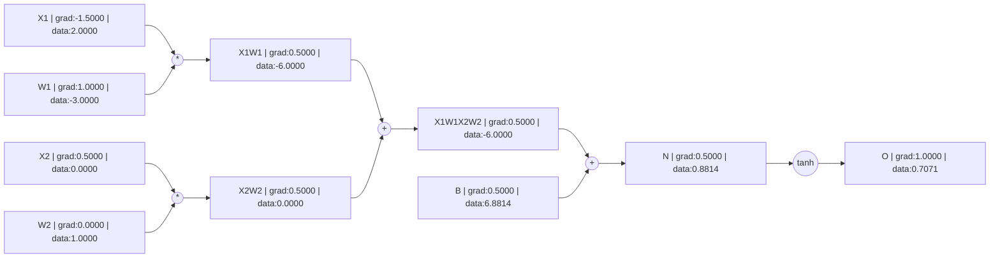

# micrograd_rb

Reimplementation of [karpathy/micrograd](https://github.com/karpathy/micrograd) in Ruby for pedagogical purposes.
Follow long with karpathy's video here: https://www.youtube.com/watch?v=VMj-3S1tku0

Here's an example of a backprop of a single perceptron

